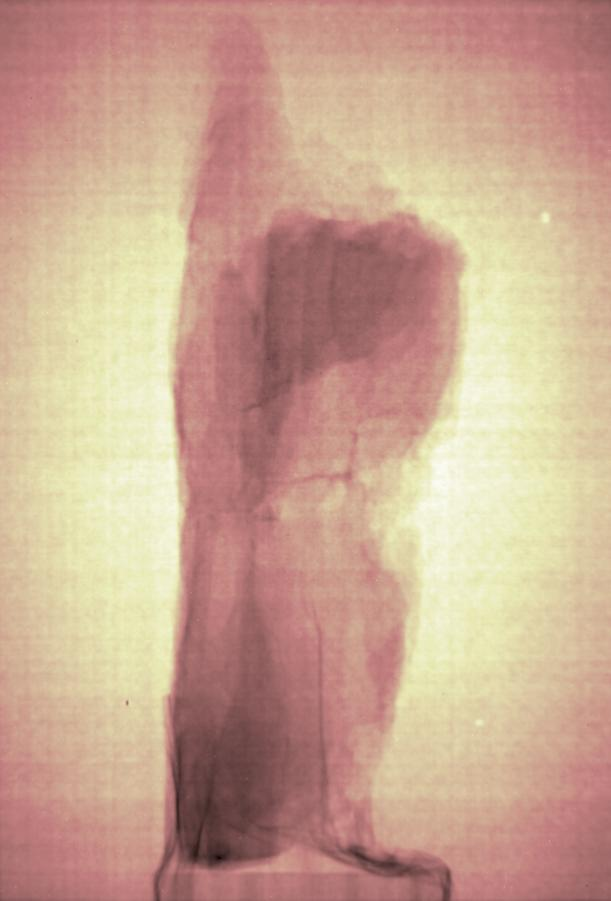
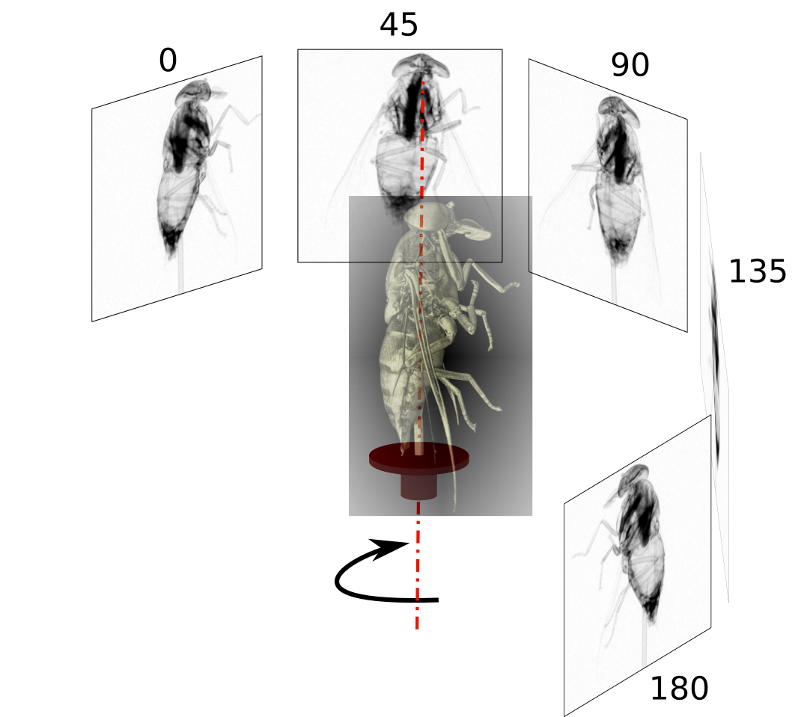
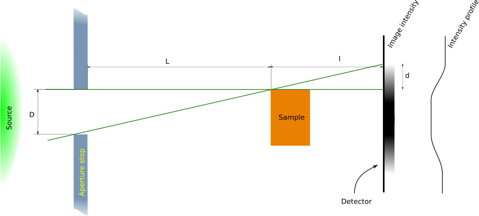
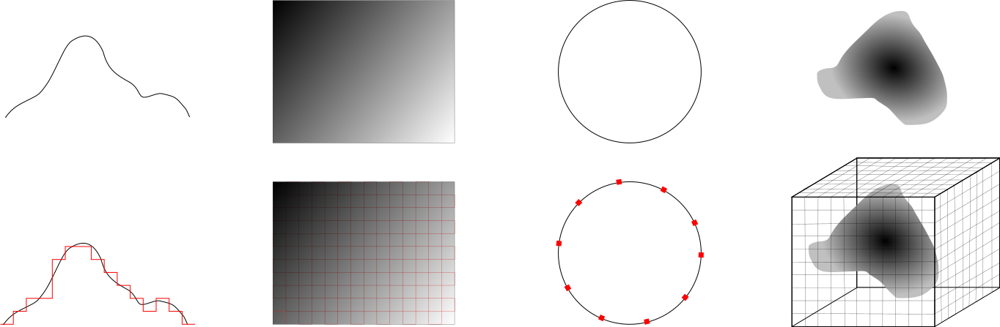
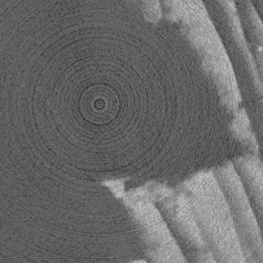

# Overview
This page contains lecture and tutorial material on computed tomography for the AUNIRA 2021 training sessions.
The material was prepared by Anders Kaestner.

# Theory 
This is a series of short lectures on different topics related to a pragmatic approach to computed tomography It will contain some math, but will not go on the depth. The purpose is to give a background in the used vocabulary to be able to understand the different problems that can arise when you start to work with computed tomography. 
<table>
<tr><th>Introduction</th><th>Radiography</th><th>Reconstruction</th><th>Geometry</th><th>Sampling</th><th>Artefacts</th></tr>
<tr><td></td>
  <td></td>
  <td></td>
  <td></td>
  <td></td>
  <td></td></tr>  
<tr><td><a href="lectures/01_TomoPrinciple_Introduction.pdf">Slides</a></td>
  <td><a href="lectures/02_TomoPrinciple_Radiography.pdf">Slides</a></td>
  <td><a href="lectures/03_TomoPrinciple_Reconstruction.pdf">Slides</a></td>
  <td><a href="lectures/04_TomoPrinciple_BeamGeometry.pdf">Slides</a></td>
  <td><a href="lectures/05_TomoPrinciple_Sampling.pdf">Slides</a></td>
  <td><a href="lectures/06_TomoPrinciple_Artifacts.pdf">Slides</a></td></tr>
</table>

# Tutorials
The tutorials are prepared to guide you through different tasks related to the reconstruction and some related image processing tasks. The tutorials are based on open source software. 

## Preparing for the tutorials
The first step to follow the tutorials is to install the needed software and data. You find the instructions on [this page](installation)

## Tutorial tasks
### Looking at the projection data using ImageJ
ImageJ is a "Swiss army knife" for image processing. We are going to take a look at some basic workflows you can perform with this tool.

The objectives of this tutorial:
- Getting started with ImageJ/FIJI
- Opening images
- Adjusting brightness and contrast
- Removing spots
- Pixelwise arithmetics applied on Beer-Lambert's law
- Saving the result with a specified precision.

<iframe width="560" height="315" src="https://www.youtube.com/embed/QQQ7RGn3-8E" title="Tomography tutorial 01 - Basic image processing" frameborder="0" allow="accelerometer; autoplay; clipboard-write; encrypted-media; gyroscope; picture-in-picture" allowfullscreen></iframe>

### Your first reconstruction
MuhRec is an open source tomography reconstruction tool. 

The objectives of this tutorial:
- Getting started with MuhRec
- Open projection data and set regions of interest
- Define geometry (number of slices, acquisition arc, center of rotation)
- Finalize reconstructed results (adjust levels, crop, rotate)
- Save result.

<iframe width="560" height="315" src="https://www.youtube.com/embed/Z_bRxvJrOjc" title="YouTube video player" frameborder="0" allow="accelerometer; autoplay; clipboard-write; encrypted-media; gyroscope; picture-in-picture" allowfullscreen></iframe>

### Measuring the pixel size
The pixel size is essential for quantitative imaging. 

The objectives of this tutorial:
- How is the pixel size measured
- Learn how to measure the pixel size using ImageJ
- User the pixel size wizard in MuhRec.

[Data for the tutorial](https://github.com/ImagingLectures/aunira2021/blob/main/data/pixelsize.zip)

<iframe width="560" height="315" src="https://www.youtube.com/embed/sQCocQ73TLU" title="YouTube video player" frameborder="0" allow="accelerometer; autoplay; clipboard-write; encrypted-media; gyroscope; picture-in-picture" allowfullscreen></iframe>

### Fine tuning the center of rotation
Finding the center of rotation is fundamental for high quality tomography reconstructions.

The objectives of this tutorial:
- Understand the what the center of rotation is.
- A method to find the center.
- Interpreting the reconstructed image and correcting misalignments.
- Correcting for axis tilts.

<iframe width="560" height="315" src="https://www.youtube.com/embed/LlExCYuaPjU" title="YouTube video player" frameborder="0" allow="accelerometer; autoplay; clipboard-write; encrypted-media; gyroscope; picture-in-picture" allowfullscreen></iframe>

### Removing artefacts
Outliers and biases of different origins produce artefacts in the reconstructed images. In the following tutorials we will target some common artefacts you will come across when you reconstruct tomography data.

#### Spots and lines

#### Stripes and rings

#### Biases caused by scattering

### Reconstructing the full volume
Until now we have only reconstructed some few slices in our exercises. The next step is to reconstruct all data into a vloume that we save on disk.

The objectives of this tutorial:
- Learn the difference between reconstructing to memory or disk.
- Memory requirements
- File formats
- Starting a reconstruction to disk
- Inspecting the recosntructed volume in ImageJ.

<iframe width="560" height="315" src="https://www.youtube.com/embed/wX4ulNdWqPI" title="YouTube video player" frameborder="0" allow="accelerometer; autoplay; clipboard-write; encrypted-media; gyroscope; picture-in-picture" allowfullscreen></iframe>

### Basic rendering using TomVis
